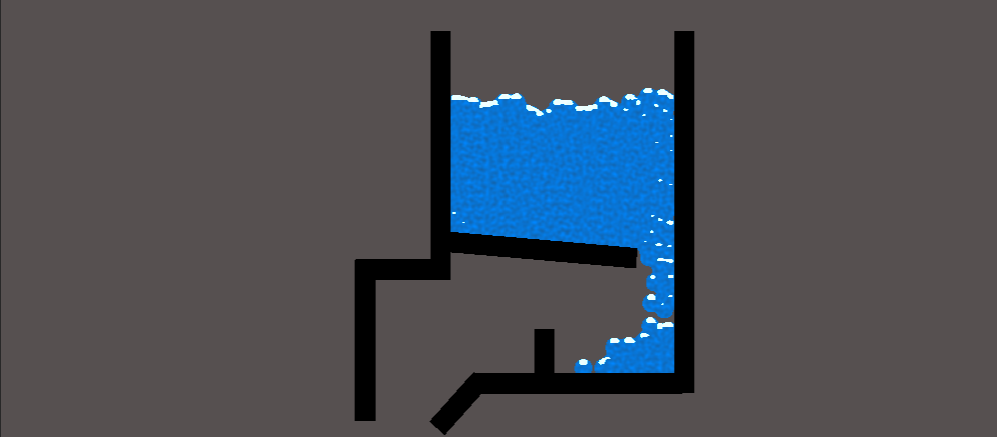
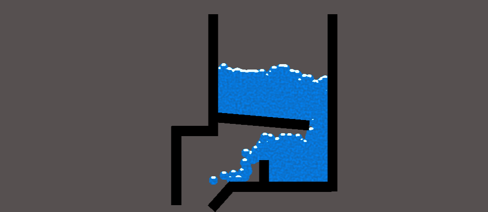
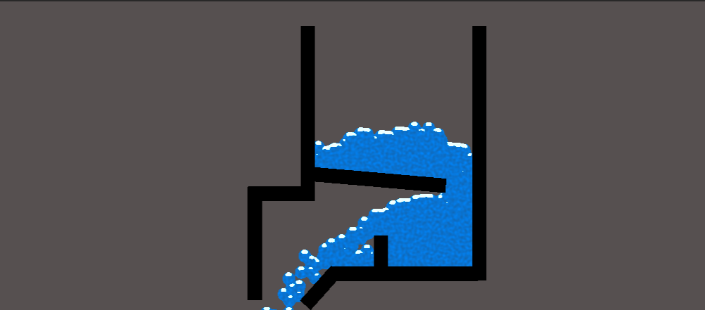

# Grafický a herní enginy

## 1. Úvod 

### Úvod
V této prezentaci si vysvětlíme co jsou to herní a grafický enginy. Probereme jejich historii, jak vypadají dnes a jak budou moct vypadat v budoucnosti. Ukážeme si pár příkladů nejznámějších enginů a co se s nimi dá vytvořit a nakonec, v praktický ukázce, budeme samy pracovat v jednom z herních enginů.
### Definice
Co je to vlastně takový herní či grafický engin? Je to určitý softwarový systém, který přenáší digitální data na naší obrazovku. Je klíčovým prvkem v mnoha odvětvích, jako například architektura, 3D modeling, filmový průmysl, ale zejména herní průmysl.
### Důležitost
Díky grafickým a herním enginům dokážeme dnes dělat již skoro fotorealistické hry či efekty. Když se podíváme například na filmový průmysl, tak grafický enginy, mimo CGI, pomáhají i tak, že namísto toho, aby se celá scéna natáčela ve skutečnosti jen proto, aby se následně škrtla, může se nejdřív „načrtnout“ v těchto enginech a pak se teprve rozhodne, zda se do filmu zahrne či ne. Šetří se tím tedy čas i prostředky. U herního průmyslu, pomáhají enginy například v tom, že daná hra je schopna se adaptovat a běžet na vícero platformách bez většího zasahování do kódu, je tedy podporován cross-platform development.

## 2. Historie a vývoj 

### Historie
V letech 1970 až 1980 vnikají první herní či grafický enginy. Dále se v průběhu let stále vyvíjejí, zlepšují a zdokonalují. V letech 1990 až 2000 se uskutečňují největší mezníky a průlomy a od let 2000 až po přítomnost tady máme už naše známé enginy.
### Mezníky ve vývoji
Za jakýmisi mezníky ve vývoji enginů můžeme považovat hry, které byly díky nim stvořeny. Jedny z prvních takových her jsou DOOM z roku 1993 a Quake z roku 1996. Byly to jedny z prvních komplexnějších her. Jako další mezník si můžeme uvést samotný Unreal engine z roku 1998, který byl jeden  prvních komplexních herních enginů a jeho nástupce Unreal engine 4 z roku 2014, nebo Unity engine z roku 2005. Oba dva enginy jsou dnes asi nejznámějšími a používají se na různou škálu věcí, ať už na vývoj her či 3D modeling, ale i kinematografii a architekturu. Za nejnovější mezníky můžeme považovat například ray tracing, který umožňuje sledování paprsků světla v reálném čase, což velice napomáhá k foto realismu, či nejnovější next gen konzole, které otevírají herním vývojářům zcela nové možnosti.
### Rozvojové směry v přítomnosti
Grafický i herní enginy se neustále rozvíjí a zdokonalují. Můžeme předpokládat, že se vydají směrem realismu a budou zdokonalovat funkce, které tomuto foto realismu dopomáhají jako například již zmíněný ray tracing. Další věc, na které se pravděpodobně bude pracovat je virtuální a rozšířená realita. Můžeme tedy očekávat, že vzniknou enginy, které budou přizpůsobeny právě pro práci s VR a AR. Nejnovějším trendem je také umělá inteligence, která bude také, dříve či později, nedílnou součástí těchto enginů a nesmíme zapomenout také na cross-platform developmnet.

## 3. Klíčové funkce

### Rendering grafiky
Teď, když jsme si již řekli co vlastně takový grafický engine je a jak se postupně vyvíjeli, můžeme probrat jak fungují uvnitř. Celý jejich princip je, že převádějí digitální data na obrazovku. Jak grafický tak i herní enginy mají také bezpočet funkcí, tak si tady představíme jen malou hrstku. Grafický enginy využívají takzvanou rendering pipeline. To zahrnuje mnoho dalších fází jako geometrické zpracování, vertex a fragment shading a post-processing a to vše spolu spolupracuje k transformaci a kreslení objektů na obrazovku. Shader programming zase umožnuje programování shaderů, které ovlivní výsledný zobrazení a shadow mapping generuje stínovou mapu, která je následně využitá při renderování, aby se dosáhlo věrohodného stínování objektů. Herní enginy využívají například scénu s objekty, což umožňuje vytvářet a manipulovat s objekty. Dále využívá fyzikální simulace, což znamená, že objekty ve scéně reagují na fyzikální síly, jako například gravitace, což přispívá k realismu. Jako poslední ukázku rady máme post-processing efekty, která jsou používány již po dokončení renderování a to zahrnuje efekty jako rozmazání, barevné filtry apod.
### Fyzikální simulace
Fyzikální simulace, jak jsme si již říkali se využívají zejména v herních, ale i v grafických enginech. To napomáhá k realistickému chování objektů. Jak tomu bylo u renderingu grafiky tak i tady využívá jak grafický tak i herní enginy spoustu funkcí, tak si tady pár z nich vysvětlíme. Fluidní simulace, jak už název napovídá, je funkce, díky které se modeluje pohyb kapalin. Využívá se to jak ve filmovém průmyslu tak i vědeckých vizualizacích. Rigid body je fyzikální simulace v herních enginech, která zahrnuje modelování tuhých těles, tedy objektů s pevnou geometrií. Soft body je v podstatě to samý, ale je to určeno pro měkká tělesa s flexibilní či deformovatelnou geometrií.

## 4. Popularní herní enginy 

### Unreal engine
Teď si povíme něco k nejznámějším enginům. Jako první si představíme Unreal engine. Je to jeden z nejvýznamnějších, jelikož, jak již bylo řečeno, byl jeden z prvních. Unreal je znám svojí funkcí blueprints. Tato funkce umožňuje vývojářům vytvářet herní logiku a interakce bez nutnosti programování. Unreal je také znám svou vysokou grafickou kvalitou a podporou vyšších grafických efektů a ray tracingu. Jedna z důležitějších funkcí Unrealu je také asset martkeplace, kde vývojáři mohou nakupovat a prodávat 3D modely, textury, animace atd. V roce 2022 byla také vydána nejnovější verze Unreal engine 5, která využívá nový technologie pro renderování grafiky a je opravdu těžké rozeznat co je obyčejná fotka a co bylo vyrenderováno v Unreal 5.
### Unity
Jako další herní engine si představíme Unity. Vývoj her v Unity enginu je, na rozdíl od Unreal enginu, snadnější, alespoň pro začátečníky. Zatímco nejběžnější programovací jazyk, používaný v Unreal enginu, je C++, v Unity to je C#. Stejně jako Unreal engine má Unity také asset store a podporuje cross-platform developmnet. Co má Unity ovšem navíc, je Unity Hub. Unity Hub je správce projektů a verzí, který usnadňuje správu projektů a přepínání mezi různými verzemi Unity.
### CryEngine
Jako poslední větší engine si představíme CryEngine. CryEngine vyvinulo studio Crytek. Původně byl vyvinut pro hru Far Cry a později použit i pro hru Crysis. CryEngine je známý pro svou vysokou grafickou kvalitu a pokročilé vizuální efekty. Je také znám svými robustnými fyzikálními simulacemi, což umožňuje realistické chování objektů.
### Další menší enginy
Je dobré zmínit i některé menší herní a grafický enginy. Například GameMaker studio. V tomto enginu se dělají především 2D hry a to velice snadno. Dále tady máme například Cinema 4D, které se využívá spíše v kinematografii.
### Příklady úspěšných her 
Když jsme si představili nejznámější herní a grafický enginy, tak si teď můžeme představit jaké hry se v nich tvořili. Populární Fortnite byl udělán v Unreal Enginu, známý Hollow Knight v Unity, Far Cry, jak již bylo zmíněno, v CryEnginu a například Hotline Miami v GameMaker Studiu.

## 5. Budoucnost grafických a herních enginů 

### Vliv nových technologií
Teď už víme něco jak o historii tak i o současném stavu grafických enginů, takže si můžeme popovídat i o jejich budoucnosti. Řekneme si něco o technologiích, které by mohly ovlivnit vývoj grafických enginů. Už zmíněný ray tracing bude mít pravděpodobně velký dopad na cestu, kterým vývoj herních a grafických enginů půjde a to sice cestou grafiky a fotorealismu. Je pravděpodobné, že se ray tracing bude zdokonalovat a vývojáři se budou snažit vymyslet další podobné technologie, které by posunuly grafiku o krok blíž skutečnosti. Je dost možné, že se vývoj vydá více cestou VR a AR a enginy se budou více snažit přizpůsobit těmto technologiím. A jako poslední stojí za zmínku generativní umělá inteligence, která by dokázala generovat zdánlivě nekonečné herní světy
### Predikce a trendy
Jako poslední si řekneme nějaké predikce a trendy, které by se mohli ve vývoji grafických enginů vyskytnout. Je dost možné, že se budou zdokonalovat technologie, které jsme si již zmiňovali, jako VR, AR, AI, coss-platform development a ray tracing. Můžeme ale také očekávat, že budu růst indie vývojáři, studia a průmysl jako takový. Dalším trendem, který se může vyskytnout je open-source přístup a vývojářský přístup, což by velice usnadnilo práci vývojářům.

## 6. Praktická ukázka 

Jako poslední věc si dnes ukážeme praktickou ukázku. Podíváme se a vysvětlíme si jak funguje snadná simulace vody v Unity enginu, o kterém jsme dnes již mluvili. Jak můžeme vidět z obrázků, voda po spuštění programu spadne a chová se asi tak, jak byste čekali. To lze docílit v podstatě dost snadno. V principu jde o velké množství objektů vedle sebe, který dělají iluzi vody. Představte si že byste pustili se kutálet do podobné dráhy, jako je na obrázku, 100 golfových míčků. Zachovali by se podobně jako voda. V programu tedy těchto míčků, nebo-li koulí, nemáme 100, ale něco přes 400. Jak na všech těchto míčkách, tak i na platformách, je zapnuta funkce rigid body a box colidor, o které jsme si dnes také již něco říkali. Díky této funkci mají koule gravitaci a padají směrem dolů a narážejí na platformy (ty mají rigid body static a díky tomu je gravitace neovlivňuje). Pokud bychom to ale nechali takhle, program by vypadal tak, jak ho popisujeme a to tedy pouze hodně míčků, který padají dolů. Abychom docílili efektu vody, musíme to ještě trochu poupravit. K tomu nám stačí upravit barvu, pozměnit tvar koule a trochu se pohrabat v nastavení, jako například dodat blur, a tím odstraníme nechtěné mezery mezi koulemi. Díky tomu už program opravdu vypadá jako simulace opravdové vody.

# 7. Shrnutí a konec

Tak jsme probrali základy grafických a herních enginů. Víme jak fungují a k čemu jsou, kde všude se používají a co od nich můžeme čekat v budoucnosti. Dozvěděli jsme se také něco málo o tom, jak se může programovat voda v jednom z těchto enginů a že ve skutečnosti, než voda, to jsou spíš dobře skryté koule. Samozřejmě to, co jsme se dnes dozvěděli, pomalu ani nesahá po kotníky celý komplexi grafických a herních enginů, pokud vás to teda zaujalo, bude skvělé, pokud si o tom zjistíte víc, protože je mnoho dalších skvělých věcí, který s grafickými enginy lze dělat a tvořit.
